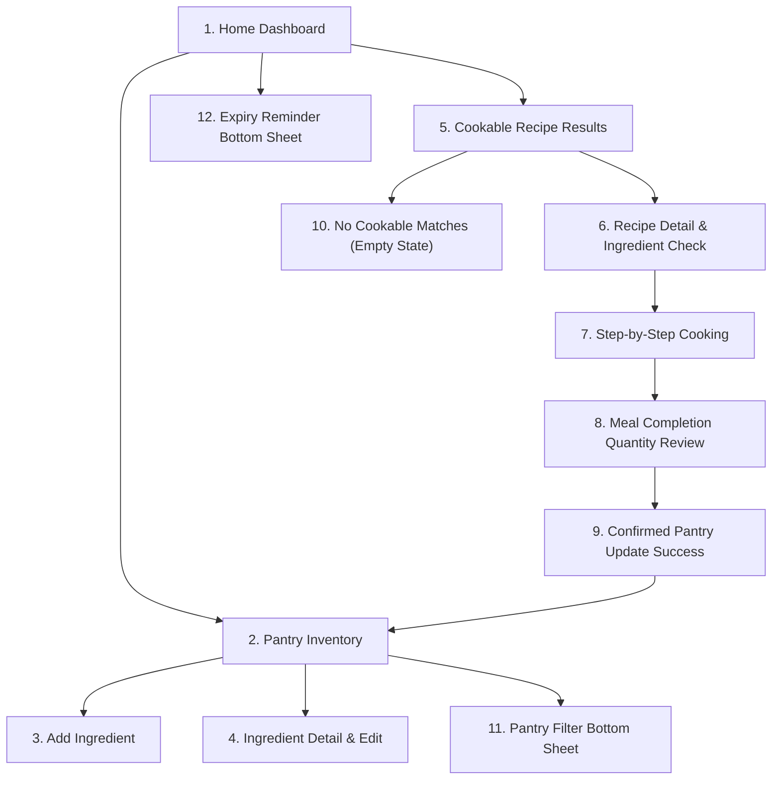
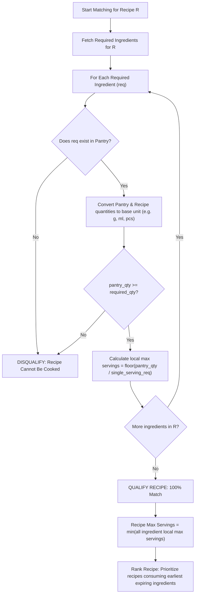
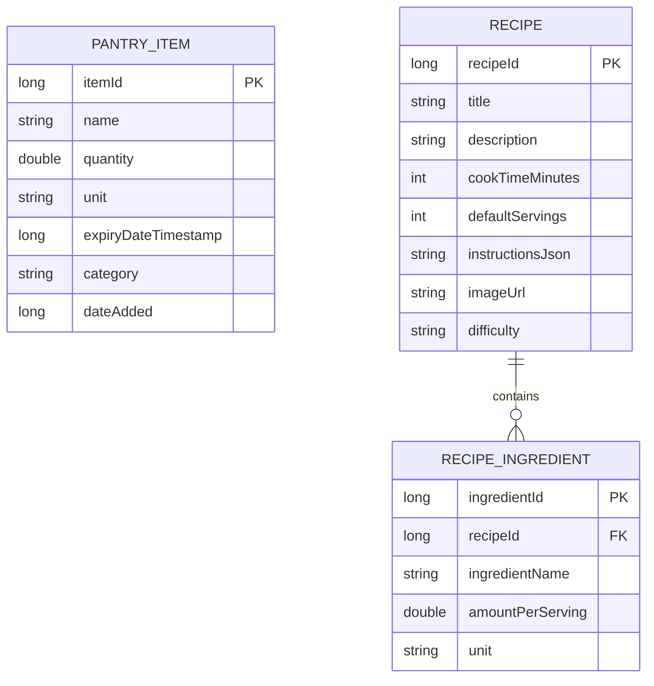

# 🥑 PantryBuddy (Home Buddy Smart Pantry)
## Architectural & UI/UX Technical Design Document

---

## 1. Executive Summary & Core Philosophy

**PantryBuddy** is a native Android application written in **Java** engineered to eradicate household food waste. Unlike standard recipe applications that suggest meals requiring a trip to the supermarket, PantryBuddy enforces a non-negotiable **Strict-Matching Business Rule**:

> **The Strict-Matching Rule:**
> A recipe is **only** suggested to the user if **100% of its required ingredients already exist in the user's pantry in sufficient quantity**. 
> No shopping trip is ever assumed. Small pantry staples (such as cooking oil, salt, black pepper, butter, and seasonings) are **never taken for granted**—they must be tracked in the pantry inventory. If a recipe requires 4 eggs and the user only has 3, or if it requires 10 ml of olive oil and the pantry has none, the recipe is strictly disqualified from the cookable feed.

### Core Value Drivers:
1. **Zero Food Waste:** Prioritizes recipes that consume ingredients nearing their expiration date.
2. **Zero Unplanned Expense:** Eliminates the frustration of starting a recipe only to realize a key staple is missing.
3. **Pantry Integrity Post-Cook:** Walking the user through an interactive **Meal Completion Quantity Review** before any pantry stock is deducted, preventing inventory drift.

---

## 2. Visual Design System & Design Tokens (From Figma Prototype)

The visual identity is derived directly from the Figma design (**Home Buddy Smart Pantry**):
- **Design URL:** [Figma Design Canvas](https://www.figma.com/design/4spg0re3UtponEqYMZZxdr/Home-Buddy-Smart-Pantry?node-id=0-1)
- **Aesthetic Tone:** Warm, culinary, calm, grounded, and organic. It avoids cold industrial grays, opting instead for comforting oatmeal, espresso roast, terracotta, and fresh sage green.

### 2.1 Color Palette

| Token Name | Hex Code | Android Resource Name | Usage in UI |
| :--- | :--- | :--- | :--- |
| **Canvas Background** | `#F7F2EA` | `colorBackground` | Warm oatmeal/cream base canvas for all activities and fragments |
| **Card Surface** | `#FFFCF7` | `colorSurface` | Elevated ivory card background for recipe cards, input fields, and lists |
| **Card Border / Divider**| `#EDE2D6` | `colorBorder` | Subtle warm border stroke (1dp) on cards and bottom sheets |
| **Primary Text (Dark)** | `#34251F` | `colorTextPrimary` | Deep espresso brown for headings, titles, and high-emphasis body text |
| **Muted Text (Secondary)**| `#82746A` | `colorTextSecondary`| Warm taupe for subtitles, helper labels, timestamps, and secondary info |
| **Fresh Green (Accent)** | `#4D6650` | `colorAccentGreen` | Sage forest green for "In your pantry", "Use today", and success badges |
| **Green Surface (Pill)** | `#E8EEDF` | `colorPillGreen` | Soft sage background for inventory tags and freshness chips |
| **Warm Clay (Action)** | `#795642` | `colorAccentClay` | Terracotta brown for primary buttons, category indicators, and icons |
| **Amber / Caramel** | `#95622E` | `colorAccentAmber` | Warning state for items expiring tomorrow, notes, and timers |
| **Urgent Rose** | `#D9534F` | `colorDangerRose` | Expired warning badges |

### 2.2 Typography Hierarchy

The typography pairs an organic, editorial serif font for titles with a clean, modern sans-serif for UI density:

| Role | Font Family | Weight | Size (sp) | Line Height | Usage |
| :--- | :--- | :--- | :--- | :--- | :--- |
| **Display Title** | `Lora` | SemiBold (600) | 26sp | 1.22em | Screen hero headers ("A meal well made", "Dinner is already here") |
| **Section Header** | `Lora` | SemiBold (600) | 24sp | 1.22em | Sheet titles, card headers, recipe names |
| **Card Subtitle** | `Inter` | SemiBold (600) | 16sp | 1.3em | Recipe card titles, dialog titles |
| **Body Primary** | `Inter` | Regular (400) | 14sp | 1.5em | Step instructions, descriptions, pantry list details |
| **Body Secondary** | `Inter` | Regular (400) | 13sp | 1.4em | Explanatory helper hints, ingredient quantities |
| **UI Label / Button**| `Inter` | SemiBold (600) | 13sp–14sp | 1.0em | Primary CTA buttons, tab labels, table column headers |
| **Badge / Overline** | `Inter` | SemiBold (600) | 11sp–12sp | 1.0em | All-caps overline tags ("SMART PANTRY", "BEFORE COOKING") |
| **Numeric Timer** | `Inter` | Bold (700) | 32sp | 1.0em | Countdown cooking timer display |

### 2.3 Component Geometry & Elevation
- **Display Frame:** Target dimensions 412dp × 916dp (modern Android high-aspect ratio devices).
- **Cards & Sheets Corner Radius:** `20dp` to `24dp` for organic rounded contours.
- **Buttons & Inputs Corner Radius:** `12dp` for tactile inputs.
- **Pills & Status Chips:** `100dp` (full pill rounding).
- **Elevation:** Flat aesthetic with subtle `1dp` border strokes (`#EDE2D6`) and soft ambient elevation (`elevation="2dp"` to `4dp`).

---

## 3. Screen Breakdown & User Journey (12 Figma Panels)



### Panel 1: Home Dashboard (`HomeFragment`)
- **Header:** "SMART PANTRY • THURSDAY, 1 OCTOBER", "Good morning, Maya", subtitle: *"Let’s make something lovely with what you have."*
- **Pantry Summary Card:** Total ingredients count ("6 ingredients in your pantry · before cooking").
- **Urgent Expiry Alert Card:** "A little love, soon · 2 to use soon" (Spinach 100g – Use today; Tomatoes 300g – Use tomorrow).
- **Featured Cookable Recipe Card:** Direct teaser card ("Tomato & spinach scramble · 15 min · 2 servings · 6 of 6 ingredients at home · Uses spinach today").
- **Bottom Navigation Bar:** 3 navigation items: `Home`, `Pantry`, `Recipes`.

### Panel 2: Pantry Inventory (`PantryFragment`)
- **Search Bar:** Real-time filter input ("Find an ingredient").
- **Filter & Sort Header:** Category chips ("All 6", "Vegetables", "Staples", "Filter" button), Sort indicator ("Soonest expiry ↓").
- **Ingredient Card List:**
  - Item name, current quantity, and unit (e.g. "Spinach • 100 g").
  - Category pill badge.
  - Expiry status pill ("Use today · 1 Oct" in green pill; "Use tomorrow" in amber pill; "Best before 31 Jan 2027" in neutral pill).
- **Footer Notice:** *"Keep quantities up to date. We only suggest meals you can make entirely from this list."*
- **Floating Action Button (FAB):** Circular add button (`+`) to launch Add Ingredient.

### Panel 3: Add Ingredient (`AddIngredientActivity` / `BottomSheet`)
- **Header:** "SMART PANTRY • ADD AN INGREDIENT", "What’s in your kitchen?", subtitle: *"A quick check now makes recipe matches reliable later."*
- **Input Fields:**
  - Ingredient Name (Autocomplete against standard ingredient catalog).
  - Quantity at home (Numeric decimal input).
  - Unit Selector (Segmented chip / spinner: `g`, `ml`, `pcs`, `tbsp`, `tsp`).
  - Expiry / Best-Before Date (Material DatePicker dialog).
  - Category Selector (`Vegetables`, `Eggs & Dairy`, `Meat & Fish`, `Staples`, `Spices & Seasonings`).
- **Core Principle Notice:** *"Small ingredients count, too. Add oil, salt and spices separately. Nothing is assumed to be in your cupboard."*
- **Action Button:** "Add to my pantry" (`#795642` button).

### Panel 4: Ingredient Detail & Edit (`IngredientDetailActivity`)
- **Header:** Hero ingredient display with quantity and category.
- **Cross-Reference Banner:** *"Your tomatoes are included in 2 recipes you can make right now."*
- **Editable Values:** Instant adjustment of quantity, unit, expiry date, or category if partial amounts were eaten outside of a recipe.
- **Actions:** "Save changes" and "See recipes using tomatoes".

### Panel 5: Cookable Recipe Results (`RecipesFragment`)
- **Hero Banner:** "Dinner is already here • You have everything for these recipes."
- **Strict Guarantee:** *"All ingredients, in enough quantity. No extras assumed. No shopping needed."*
- **Filter Tags:** "Use soon first", "Under 20 min".
- **Result Cards:**
  - Badge: "6 of 6 ingredients at home" (Green pill).
  - Recipe title, cooking duration, servings, and tags ("Uses spinach today").
  - Ingredient breakdown snapshot preview.

### Panel 6: Recipe Detail & Ingredient Check (`RecipeDetailActivity`)
- **Header:** High-quality food photography banner, recipe title, time, difficulty, and one-pan tag.
- **Dynamic Serving Scaler:** Calculates maximum servings possible with current pantry: *"2 servings (Maximum with your 4 eggs)"*.
- **3-Column Verification Table:**
  - Column 1: **INGREDIENT** (e.g. Eggs, Tomatoes, Spinach, Olive oil, Salt, Black pepper).
  - Column 2: **NEEDED** (e.g. 4 pcs, 200 g, 80 g, 10 ml, 2 g, 1 g).
  - Column 3: **AT HOME** (e.g. 4 pcs, 300 g, 100 g, 40 ml, 10 g, 6 g).
- **Post-Cooking Projection:** *"Quantities leave 100 g tomatoes and 20 g spinach for later."*
- **Primary CTA:** "Start cooking · 2 servings".

### Panel 7: Step-by-Step Cooking (`CookingActivity`)
- **Guided Mode:** Fullscreen distraction-free cooking assistant.
- **Progress Tracker:** Step counter ("Step 2 of 3 • About 8 min left").
- **Technique & Measurement Text:** Clear instructions with embedded ingredient measurements.
- **Interactive Countdown Timer:** Built-in countdown widget (`03:00` with Play/Pause button and sound/vibration alert upon completion).
- **Safety Reassurance:** *"Your pantry stays unchanged until you review and confirm what you used."*

### Panel 8: Meal Completion Quantity Review (`MealReviewActivity`)
- **Header:** "A meal well made • Tomato & spinach scramble • 2 servings cooked".
- **Review Table:**
  - Column 1: **INGREDIENT**
  - Column 2: **BEFORE**
  - Column 3: **ACTUALLY USED** (Editable number fields in case user used slightly more/less).
  - Column 4: **WILL REMAIN** (Auto-computed in real time).
- **Explicit Checkbox:** ☑ *"I checked these amounts. They reflect what I actually used, including oil, salt and pepper."*
- **Action:** "Confirm quantities & update pantry".

### Panel 9: Confirmed Pantry Update Success (`PantryUpdateSuccessActivity`)
- **Summary Feedback:** Displays the confirmed inventory delta (e.g. "Eggs: 4 → 0 pcs; Tomatoes: 300 → 100 g").
- **Notification:** *"5 ingredients remain. Eggs are marked used up. All expiry dates are unchanged."*
- **Re-Matching Trigger:** Background re-evaluation of all recipes with updated quantities.
- **Action Button:** "View my updated pantry".

### Panel 10: No Cookable Recipe Matches (`NoMatchesState` in Recipes)
- **Honest Feedback:** *"None of our recipes can be made with your remaining amounts. We won’t show meals that need something you don’t have."*
- **Stock Audit:** Lists remaining pantry ingredients and their ongoing shelf-life reminders.
- **Action Button:** "Check or correct my pantry".

### Panel 11: Pantry Filter Bottom Sheet (`PantryFilterBottomSheet`)
- Quick-filter drawer for Categories, "Use soon only" toggle (due today or next 2 days), and sorting preferences.

### Panel 12: Expiry Reminder Bottom Sheet (`ExpiryReminderBottomSheet`)
- Proactive contextual alert showing items expiring today/tomorrow, with quick link to cookable recipes or a 5 PM snooze reminder.

---

## 4. Technical Architecture (Android Java)

```
app/src/main/java/com/example/pantrybuddy/
├── data/
│   ├── local/
│   │   ├── AppDatabase.java            // Room database singleton
│   │   ├── dao/
│   │   │   ├── PantryDao.java          // Inventory CRUD & deduction transactions
│   │   │   └── RecipeDao.java          // Recipe queries & cross-referencing
│   │   └── entity/
│   │       ├── PantryItem.java         // User's inventory entity
│   │       ├── Recipe.java             // Recipe header entity
│   │       └── RecipeIngredient.java   // Required ingredient entity
│   ├── remote/
│   │   ├── RecipeApiService.java       // Retrofit interface (Spoonacular / Edamam)
│   │   └── dto/                        // API JSON Data Transfer Objects
│   └── repository/
│       ├── PantryRepository.java       // Single source of truth for pantry
│       └── RecipeRepository.java       // Orchestrates local + remote recipes
├── domain/
│   ├── engine/
│   │   ├── StrictRecipeMatcher.java    // The 100% strict matching algorithm
│   │   └── UnitConverter.java          // Converts g/kg, ml/l, pcs
│   └── model/
│       ├── MatchResult.java            // Match status, missing items, max servings
│       └── ExpiryStatus.java           // TODAY, TOMORROW, SOON, SAFE
├── ui/
│   ├── common/                         // Base classes, custom views, adapters
│   ├── home/                           // Home dashboard ViewModel & Fragment
│   ├── pantry/                         // Inventory list, filter sheet, add dialog
│   ├── recipes/                        // Recipe list, details, 3-column check
│   └── cooking/                        // Step-by-step timer & completion review
└── utils/
    ├── NotificationHelper.java         // Expiry push alerts
    └── ExpiryReminderWorker.java       // WorkManager daily scheduler
```

### 4.1 Technology Stack Selection & Rationale

| Layer | Library / Technology | Version / Spec | Why Selected |
| :--- | :--- | :--- | :--- |
| **Language** | **Java** | OpenJDK 11 / 17 | User's explicit choice; robust, type-safe, widely supported in Android. |
| **Target OS** | Android SDK | `minSdk = 24` (Android 7.0+), `targetSdk = 37` | Covers 95%+ of active Android devices worldwide. |
| **UI Components** | **Material Design 3 (M3)** | `com.google.android.material:material` | Provides BottomSheets, MaterialCards, Chips, Dialogs matching Figma tokens. |
| **Architecture** | **MVVM + Repository** | Android Jetpack Lifecycle (`ViewModel`, `LiveData`) | Ensures separation of concerns; keeps business logic out of Activities/Fragments. |
| **Database** | **Room (SQLite)** | `androidx.room:room-runtime:2.6.x` | Official Android ORM with Java support, compile-time SQL verification, and `@Transaction` atomic operations. |
| **Networking** | **Retrofit 2 + OkHttp 3** | `com.squareup.retrofit2:retrofit:2.11.x` | Industry standard Java REST client for recipe retrieval with connection pooling. |
| **JSON Parser** | **Gson** | `com.google.code.gson:gson:2.11.x` | Fast, reliable serialization/deserialization for network and Room TypeConverters. |
| **Image Loading**| **Glide** | `com.github.bumptech.glide:glide:4.16.x` | High-performance bitmap caching, rounded corner transformations, and placeholders. |
| **Background Tasks**| **WorkManager** | `androidx.work:work-runtime:2.9.x` | Battery-friendly, persistent background scheduling for daily 9 AM/5 PM expiry reminders. |

---

## 5. The Strict Recipe Matching Engine

The core business logic of the app is contained within `StrictRecipeMatcher.java`.

### 5.1 Formal Algorithm Specification



### 5.2 Unit Normalization Rules
To compare quantities accurately, a standard unit equivalence map is enforced:
- **Mass:** Base unit = `grams (g)`. 1 kg = 1,000 g.
- **Volume:** Base unit = `milliliters (ml)`. 1 liter = 1,000 ml; 1 tbsp ≈ 15 ml; 1 tsp ≈ 5 ml.
- **Count:** Base unit = `pieces (pcs)`. Eggs, cloves of garlic, onions.
- **Strict Incompatibility:** If a recipe requires `grams` of an ingredient that the user logged as `pieces` (e.g. 200g tomatoes vs 2 pcs tomatoes), the engine performs an average weight estimate (e.g., 1 medium tomato ≈ 120g) with an explicit confirmation badge on the Recipe Detail screen.

### 5.3 Serving Scaler Logic
The Recipe Detail screen lets the user cook 1, 2, or more servings. The app computes:
$$\text{Max Servings} = \min_{i \in \text{Ingredients}} \left\lfloor \frac{\text{Pantry Quantity}_i}{\text{Quantity Required per Serving}_i} \right\rfloor$$
If the user's 4 eggs allow at most 2 servings of scramble, the serving counter caps at 2.

---

## 6. Recipe Retrieval Strategy (Hybrid Online & Offline)

To ensure the user is never stranded without recipes when offline (e.g. during camping or network outages), PantryBuddy employs a **hybrid data strategy**:

### 6.1 Layer 1: Offline Curated Pantry Database (Bundled Asset)
- The app ships with a pre-seeded Room SQLite database (`pantry_recipes.db` in `assets/`).
- Contains **60+ versatile, zero-waste recipes** specifically designed around typical leftover ingredients:
  - Scrambles, frittatas, and omelets (eggs + any vegetable).
  - Fried rice, risottos, and stir-fries (rice/grains + leftover proteins).
  - One-pot vegetable and lentil stews.
  - Simple dressings and warm salads.
- Every recipe has strict itemization down to salt, pepper, and cooking fat.

### 6.2 Layer 2: Online Recipe API Integration (Spoonacular / TheMealDB)
- **Primary API:** **Spoonacular Recipe Search API** (`/recipes/findByIngredients`).
  - Parameter: `ingredients = [pantry_items_comma_separated]`
  - Parameter: `ranking = 1` (maximize used ingredients)
  - Parameter: `ignorePantry = false` (**Critical:** forces Spoonacular to account for salt, oil, and spices!)
- **Strict Filtering Filter:**
  - Upon receiving API responses, PantryBuddy parses the `missedIngredientCount`.
  - **Only recipes with `missedIngredientCount == 0` are accepted.** Any recipe requiring external items is automatically discarded.
- **Local Caching:** All fetched recipes are immediately cached into Room so that once queried, they remain accessible offline forever.

---

## 7. Data Models & Database Schema (Room)



### Entity Annotations (Java Room):
1. **`PantryItem`**:
   - `itemId` (Primary Key, auto-generate)
   - `name` (Indexed for fast lookup)
   - `quantity` (Double, current amount)
   - `unit` (`g`, `ml`, `pcs`, etc.)
   - `expiryDate` (Timestamp, indexed for sort queries)
   - `category` (`VEGETABLES`, `DAIRY`, `STAPLES`, etc.)
2. **`Recipe`**:
   - `recipeId` (Primary Key)
   - `title`, `description`, `cookTimeMinutes`, `defaultServings`, `imageUrl`, `difficulty`
3. **`RecipeIngredient`**:
   - Foreign key to `Recipe` with `CASCADE` delete
   - `ingredientName`, `amountPerServing`, `unit`

---

## 8. Implementation Roadmap (Phases)

| Phase | Milestone | Deliverables |
| :-: | :--- | :--- |
| **Phase 1** | **Theme & UI Shell** | Colors, typography (Lora + Inter), styles, navigation container, bottom bar |
| **Phase 2** | **Room DB & Inventory CRUD** | `PantryItem` entity, `PantryDao`, repository, Add/Edit dialogs, RecyclerView |
| **Phase 3** | **Matching Engine & Unit Converter**| `StrictRecipeMatcher.java`, unit tests verifying 100% strict matching behavior |
| **Phase 4** | **Recipe Discovery & Verification** | `RecipesFragment`, 3-column Recipe Detail verification table, serving scaler |
| **Phase 5** | **Cooking Assistant & Inventory Deduction** | Step-by-step timer, `MealReviewActivity`, atomic stock reduction transaction |
| **Phase 6** | **Expiry Nudges & Background Alerts** | Bottom sheets, WorkManager scheduler, push notifications |

---

*Document compiled in alignment with the official Figma specification: [Home Buddy Smart Pantry (Node 0:1)](https://www.figma.com/design/4spg0re3UtponEqYMZZxdr/Home-Buddy-Smart-Pantry?node-id=0-1).*
