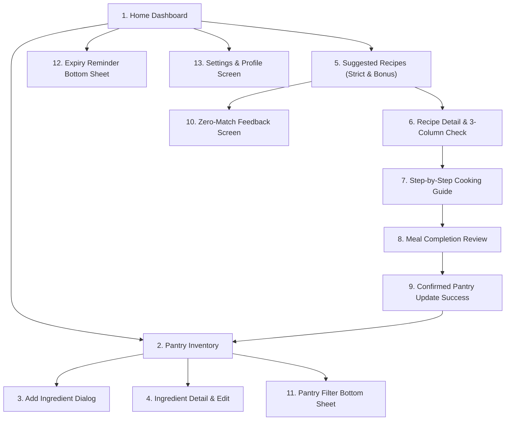
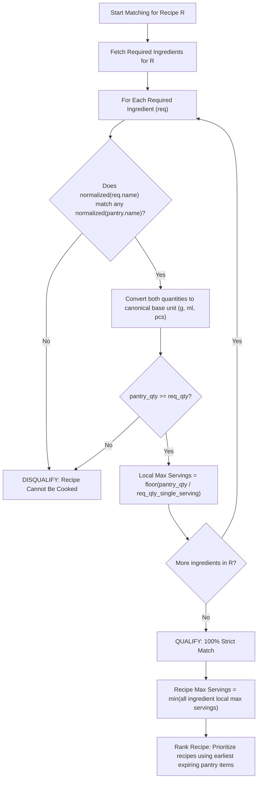
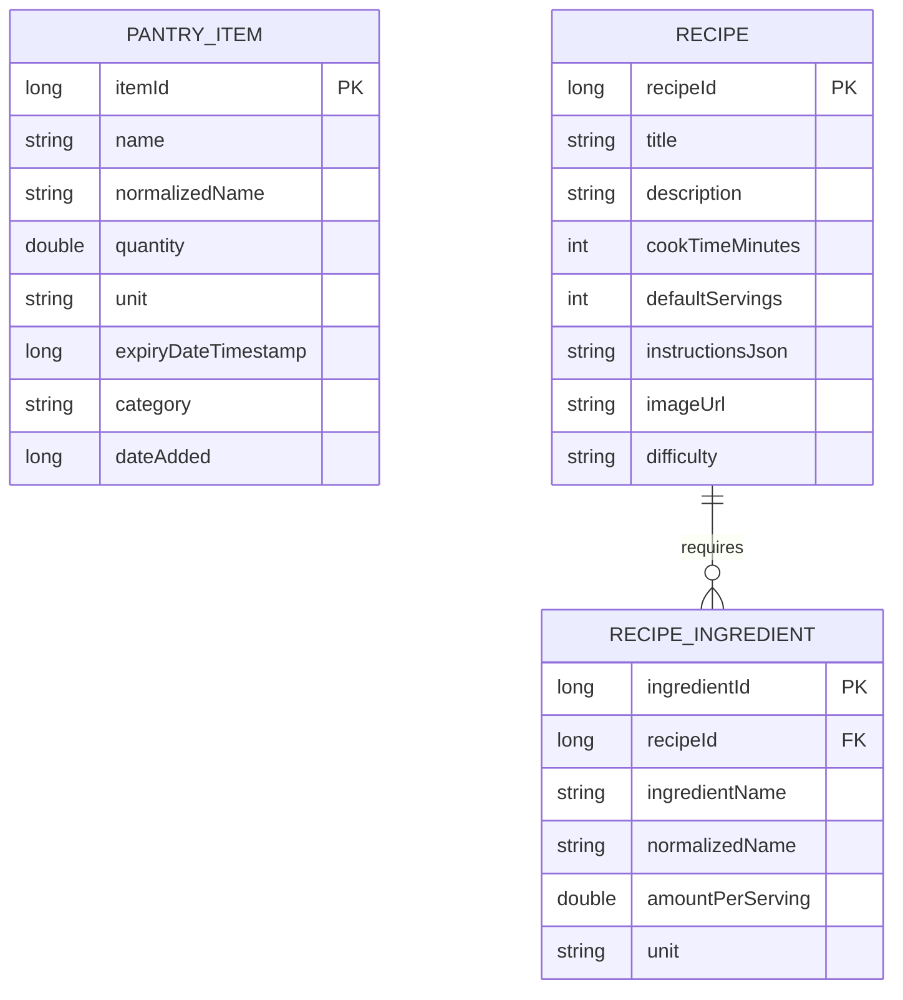

# 🥑 PantryBuddy (Home Buddy Smart Pantry)
## Architectural & UI/UX Technical Design Document

---

## 1. Executive Summary & Core Philosophy

**PantryBuddy** is a native Android application written in **Java** engineered to eradicate household food waste. Unlike conventional recipe applications that suggest meals requiring a trip to the supermarket, PantryBuddy enforces a non-negotiable **Strict-Matching Business Rule**:

> ### 🛑 The Strict-Matching Rule (The Core Metric)
> A recipe is **only** suggested to the user if **100% of its required ingredients already exist in the user's pantry in sufficient quantity**. 
> 
> **Zero Assumptions Policy:** Pantry staples—such as cooking oil, table salt, black pepper, butter, and seasonings—are **never taken for granted**. They are explicitly tracked in the pantry inventory. If a recipe requires 4 eggs and the user has 3, or if it requires 10 ml of olive oil and the pantry has none, that recipe is **strictly disqualified** from the cookable feed.

### 1.1 Compliance with Project Rules & Marker Rubric

This specification strictly conforms to all academic and operational rubric criteria:

| Rubric Requirement | Implementation Strategy in PantryBuddy | Status |
| :--- | :--- | :---: |
| **1. Pantry Management (CRUD)** | Complete database-backed Add, Edit, Delete, and View operations for pantry items (name, quantity, unit, and optional expiry date). | ✅ Full Compliance |
| **2. Reactive Pantry List** | Fast, reactive `RecyclerView` bound via Android Architecture Components (`Room`, `ViewModel`, `LiveData`) with real-time expiration badges. | ✅ Full Compliance |
| **3. Seeded Recipe Collection (15–20 Recipes)** | Pre-loaded Room database seeded on first run with **18 curated zero-waste recipes**, complete with itemized staples (salt, oil, pepper) and preparation steps. | ✅ Full Compliance (18 Recipes) |
| **4. Strict-Matching Rule** | A recipe appears in "Suggested Recipes" **only** if every single required ingredient is present in the pantry in at least the required quantity. No partial matches in main feed. | ✅ Full Compliance (Core Rule) |
| **5. Bonus Stretch ("Almost There" Tier)** | An isolated, clearly segregated secondary tier displaying recipes missing **exactly 1 ingredient**, tagged with what is missing, without contaminating strict results. | ✅ Full Compliance (Bonus Stretch) |
| **6. Robust Real-World Matching** | An intelligent normalizer that handles singular/plural names (`tomato` vs `tomatoes`, `egg` vs `eggs`), whitespace/case insensitivity, and metric/imperial unit conversions (`g` ↔ `kg`, `ml` ↔ `l`). | ✅ Full Compliance |
| **7. Zero-Matches Feedback** | Warm, diagnostic empty-state UI (*"No recipes match your pantry yet — add more ingredients"*) with remaining stock audits, preventing blank screens. | ✅ Full Compliance |
| **8. Settings / Profile Screen** | Screen with expiry reminder toggles (9 AM / 5 PM), measurement unit preferences (Metric/Imperial), and a **"Reset Sample Data" marker button**. | ✅ Full Compliance |
| **9. Strict Location Restriction** | **Zero** Google Maps SDK, zero GPS, zero location permissions, zero nearby store lookups. Scope is strictly localized to the user's pantry. | ✅ Full Compliance |

---

## 2. Visual Design System & Design Tokens (From Figma Prototype)

The visual identity is derived directly from the official Figma design (**Home Buddy Smart Pantry**):
- **Figma Canvas:** [Home Buddy Smart Pantry (Node 0:1)](https://www.figma.com/design/4spg0re3UtponEqYMZZxdr/Home-Buddy-Smart-Pantry?node-id=0-1)
- **Aesthetic Tone:** Warm, culinary, calm, grounded, and organic. It avoids cold industrial grays, opting instead for comforting oatmeal, espresso roast, terracotta, and fresh sage green.

### 2.1 Color Palette

```
+-----------------------------------------------------------------------------+
|  Primary Canvas: Oatmeal (#F7F2EA)     |  Card Surface: Ivory (#FFFCF7)     |
|  Border / Stroke: Sand (#EDE2D6)       |  Primary Text: Espresso (#34251F)  |
|  Accent Green: Sage Forest (#4D6650)   |  Pill Green: Soft Sage (#E8EEDF)   |
|  Action Clay: Terracotta (#795642)     |  Warning Amber: Caramel (#95622E)  |
+-----------------------------------------------------------------------------+
```

| Token Name | Hex Code | Android Resource Name | Usage in UI |
| :--- | :--- | :--- | :--- |
| **Canvas Background** | `#F7F2EA` | `colorBackground` | Warm oatmeal/cream base canvas for all activities and fragments |
| **Card Surface** | `#FFFCF7` | `colorSurface` | Elevated ivory card background for recipe cards, input fields, and lists |
| **Card Border / Divider**| `#EDE2D6` | `colorBorder` | Subtle warm border stroke (1dp) on cards and bottom sheets |
| **Primary Text (Dark)** | `#34251F` | `colorTextPrimary` | Deep espresso brown for headings, titles, and high-emphasis body text |
| **Muted Text (Secondary)**| `#82746A` | `colorTextSecondary`| Warm taupe for subtitles, helper labels, timestamps, and secondary info |
| **Fresh Green (Accent)** | `#4D6650` | `colorAccentGreen` | Sage forest green for "In your pantry", "Use today", and success badges |
| **Green Surface (Pill)** | `#E8EEDF` | `colorPillGreen` | Soft sage background for inventory tags and freshness chips |
| **Warm Clay (Action)** | `#795642` | `colorAccentClay` | Terracotta brown for primary buttons, category indicators, and icons |
| **Amber / Caramel** | `#95622E` | `colorAccentAmber` | Warning state for items expiring tomorrow, "Almost There" tags, notes |
| **Urgent Rose** | `#D9534F` | `colorDangerRose` | Expired warning badges and delete confirmation actions |

### 2.2 Typography Hierarchy

The typography pairs an organic, editorial serif font for titles with a clean, modern sans-serif for UI density:

| Role | Font Family | Weight | Size (sp) | Line Height | Usage |
| :--- | :--- | :--- | :--- | :--- | :--- |
| **Display Title** | `Lora` | SemiBold (600) | 26sp | 1.22em | Screen hero headers ("A meal well made", "Dinner is already here") |
| **Section Header** | `Lora` | SemiBold (600) | 24sp | 1.22em | Sheet titles, card headers, recipe names |
| **Card Subtitle** | `Inter` | SemiBold (600) | 16sp | 1.3em | Recipe card titles, dialog titles |
| **Body Primary** | `Inter` | Regular (400) | 14sp | 1.5em | Step instructions, descriptions, pantry list details |
| **Body Secondary** | `Inter` | Regular (400) | 13sp | 1.4em | Explanatory helper hints, ingredient quantities |
| **UI Label / Button**| `Inter` | SemiBold (600) | 13sp–14sp | 1.0em | Primary CTA buttons, tab labels, table column headers |
| **Badge / Overline** | `Inter` | SemiBold (600) | 11sp–12sp | 1.0em | All-caps overline tags ("SMART PANTRY", "BEFORE COOKING") |
| **Numeric Timer** | `Inter` | Bold (700) | 32sp | 1.0em | Countdown cooking timer display |

### 2.3 Component Geometry & Elevation
- **Display Frame:** Target dimensions 412dp × 916dp (modern Android high-aspect ratio devices).
- **Cards & Sheets Corner Radius:** `20dp` to `24dp` for organic rounded contours.
- **Buttons & Inputs Corner Radius:** `12dp` for tactile inputs.
- **Pills & Status Chips:** `100dp` (full pill rounding).
- **Elevation:** Flat aesthetic with subtle `1dp` border strokes (`#EDE2D6`) and soft ambient elevation (`elevation="2dp"` to `4dp`).

---

## 3. Screen Breakdown & User Journey (13 Screens)



### Panel 1: Home Dashboard (`HomeFragment`)
- **Header:** "SMART PANTRY • THURSDAY, 1 OCTOBER", "Good morning, Maya", subtitle: *"Let’s make something lovely with what you have."*
- **Pantry Summary Card:** Total ingredients count ("6 ingredients in your pantry · before cooking").
- **Urgent Expiry Alert Card:** "A little love, soon · 2 to use soon" (Spinach 100g – Use today; Tomatoes 300g – Use tomorrow).
- **Featured Cookable Recipe Card:** Direct teaser card ("Tomato & spinach scramble · 15 min · 2 servings · 6 of 6 ingredients at home · Uses spinach today").
- **Bottom Navigation Bar:** 4 navigation items: `Home`, `Pantry`, `Recipes`, `Settings`.

### Panel 2: Pantry Inventory (`PantryFragment`)
- **Search Bar:** Real-time filter input ("Find an ingredient").
- **Filter & Sort Header:** Category chips ("All 6", "Vegetables", "Staples", "Filter" button), Sort indicator ("Soonest expiry ↓").
- **Ingredient Card List (`RecyclerView`):**
  - Item name, current quantity, and unit (e.g. "Spinach • 100 g").
  - Category pill badge.
  - Expiry status pill ("Use today · 1 Oct" in green pill; "Use tomorrow" in amber pill; "Best before 31 Jan 2027" in neutral pill).
- **Footer Notice:** *"Keep quantities up to date. We only suggest meals you can make entirely from this list."*
- **Floating Action Button (FAB):** Circular add button (`+`) to launch Add Ingredient.

### Panel 3: Add Ingredient (`AddIngredientActivity` / `BottomSheet`)
- **Header:** "SMART PANTRY • ADD AN INGREDIENT", "What’s in your kitchen?", subtitle: *"A quick check now makes recipe matches reliable later."*
- **Input Fields:**
  - Ingredient Name (Autocomplete with normalizer suggestions).
  - Quantity at home (Numeric decimal input).
  - Unit Selector (Segmented chip / spinner: `g`, `ml`, `pcs`, `tbsp`, `tsp`).
  - Expiry / Best-Before Date (Material DatePicker dialog, optional).
  - Category Selector (`Vegetables`, `Eggs & Dairy`, `Meat & Fish`, `Staples`, `Spices & Seasonings`).
- **Core Principle Notice:** *"Small ingredients count, too. Add oil, salt and spices separately. Nothing is assumed to be in your cupboard."*
- **Action Button:** "Add to my pantry" (`#795642` button).

### Panel 4: Ingredient Detail & Edit (`IngredientDetailActivity`)
- **Header:** Hero ingredient display with quantity and category.
- **Cross-Reference Banner:** *"Your tomatoes are included in 2 recipes you can make right now."*
- **Editable Values:** Instant adjustment of quantity, unit, expiry date, or category if partial amounts were eaten outside of a recipe.
- **Actions:** "Save changes", "Delete ingredient", and "See recipes using tomatoes".

### Panel 5: Suggested Recipes Screen (`RecipesFragment`)
- **Hero Banner:** "Dinner is already here • You have everything for these recipes."
- **Strict Guarantee:** *"All ingredients, in enough quantity. No extras assumed. No shopping needed."*
- **Filter Tags:** "Use soon first", "Under 20 min".
- **Primary Section: 100% Strictly Cookable Recipes:**
  - Badge: "6 of 6 ingredients at home" (Green pill).
  - Recipe title, cooking duration, servings, and tags ("Uses spinach today").
  - Ingredient breakdown snapshot preview.
- **Secondary Section: Bonus Stretch "Almost There" (Strictly Partitioned):**
  - Divided by a prominent visual divider and amber badge: *"Missing 1 Ingredient — Shopping Required"*.
  - Displays recipes where exactly 1 item is missing or short.
  - Explicitly states what is missing (e.g. *"Missing: 10 ml Olive Oil"*).

### Panel 6: Recipe Detail & Ingredient Check (`RecipeDetailActivity`)
- **Header:** High-quality food photography banner, recipe title, time, difficulty, and one-pan tag.
- **Dynamic Serving Scaler:** Calculates maximum servings possible with current pantry: *"2 servings (Maximum with your 4 eggs)"*.
- **3-Column Verification Table:**
  - Column 1: **INGREDIENT** (e.g. Eggs, Tomatoes, Spinach, Olive oil, Salt, Black pepper).
  - Column 2: **NEEDED** (e.g. 4 pcs, 200 g, 80 g, 10 ml, 2 g, 1 g).
  - Column 3: **AT HOME** (e.g. 4 pcs, 300 g, 100 g, 40 ml, 10 g, 6 g).
- **Post-Cooking Projection:** *"Quantities leave 100 g tomatoes and 20 g spinach for later."*
- **Primary CTA:** "Start cooking · 2 servings".

### Panel 7: Step-by-Step Cooking Guide (`CookingActivity`)
- **Guided Mode:** Fullscreen distraction-free cooking assistant.
- **Progress Tracker:** Step counter ("Step 2 of 3 • About 8 min left").
- **Technique & Measurement Text:** Clear instructions with embedded ingredient measurements.
- **Interactive Countdown Timer:** Built-in countdown widget (`03:00` with Play/Pause button and sound/vibration alert upon completion).
- **Safety Reassurance:** *"Your pantry stays unchanged until you review and confirm what you used."*

### Panel 8: Meal Completion Quantity Review (`MealReviewActivity`)
- **Header:** "A meal well made • Tomato & spinach scramble • 2 servings cooked".
- **Review Table:**
  - Column 1: **INGREDIENT**
  - Column 2: **BEFORE**
  - Column 3: **ACTUALLY USED** (Editable number fields in case user used slightly more/less).
  - Column 4: **WILL REMAIN** (Auto-computed in real time).
- **Explicit Checkbox:** ☑ *"I checked these amounts. They reflect what I actually used, including oil, salt and pepper."*
- **Action:** "Confirm quantities & update pantry".

### Panel 9: Confirmed Pantry Update Success (`PantryUpdateSuccessActivity`)
- **Summary Feedback:** Displays the confirmed inventory delta (e.g. "Eggs: 4 → 0 pcs; Tomatoes: 300 → 100 g").
- **Notification:** *"5 ingredients remain. Eggs are marked used up. All expiry dates are unchanged."*
- **Re-Matching Trigger:** Background re-evaluation of all recipes with updated quantities.
- **Action Button:** "View my updated pantry".

### Panel 10: Zero Cookable Recipe Matches Feedback (`NoMatchesState`)
- **Honest Feedback:** *"None of our recipes can be made with your remaining amounts. We won’t show meals that need something you don’t have."*
- **Stock Audit:** Lists remaining pantry ingredients and their ongoing shelf-life reminders.
- **Diagnostic Guidance:** Highlights which common staple (e.g. cooking oil or eggs) would unlock the most recipes if added.
- **Action Button:** "Check or correct my pantry".

### Panel 11: Pantry Filter Bottom Sheet (`PantryFilterBottomSheet`)
- Quick-filter drawer for Categories, "Use soon only" toggle (due today or next 2 days), and sorting preferences.

### Panel 12: Expiry Reminder Bottom Sheet (`ExpiryReminderBottomSheet`)
- Proactive contextual alert showing items expiring today/tomorrow, with quick link to cookable recipes or a 5 PM snooze reminder.

### Panel 13: Settings & Preferences Screen (`SettingsFragment`)
- **Minimum-Screens Requirement Compliance:** Dedicated settings activity/fragment satisfying Section 3.1 of the project brief.
- **Expiry Notification Toggles:** Switch to enable/disable daily push alerts at 9:00 AM and 5:00 PM.
- **Measurement Unit Preference:** Radio buttons for `Metric (g, ml)` vs `Imperial (oz, fl oz, cups)`.
- **Anti-Waste Urgency Threshold:** Slider/Picker to set days remaining for "Expiring Soon" alert (1 day, 2 days, 3 days).
- **Marker Testing Tool ("Reset Sample Data"):** A one-click button that populates the pantry with the default Figma scenario (4 eggs, 300g tomatoes, 100g spinach, 40ml olive oil, 10g salt, 6g black pepper) to immediately test strict recipe matching.
- **Privacy & Permissions Audit Card:** Explicitly states: *"No Location or GPS used. No network tracking. Local SQLite database."*

---

## 4. Technical Architecture (Android Java)

```
app/src/main/java/com/example/pantrybuddy/
├── data/
│   ├── local/
│   │   ├── AppDatabase.java            // Room database singleton with pre-populate callback
│   │   ├── dao/
│   │   │   ├── PantryDao.java          // Inventory CRUD & atomic deduction transactions
│   │   │   └── RecipeDao.java          // Recipe queries, ingredients & relation joins
│   │   └── entity/
│   │       ├── PantryItem.java         // User's inventory entity
│   │       ├── Recipe.java             // Recipe header entity
│   │       └── RecipeIngredient.java   // Required ingredient entity (with foreign keys)
│   ├── remote/
│   │   ├── RecipeApiService.java       // Retrofit interface (Spoonacular / TheMealDB fallback)
│   │   └── dto/                        // API JSON Data Transfer Objects
│   └── repository/
│       ├── PantryRepository.java       // Single source of truth for pantry inventory
│       └── RecipeRepository.java       // Coordinates local database + matching queries
├── domain/
│   ├── engine/
│   │   ├── StrictRecipeMatcher.java    // The 100% strict matching algorithm
│   │   ├── AlmostThereMatcher.java     // Bonus stretch 1-missing ingredient analyzer
│   │   ├── IngredientNormalizer.java   // Singular/plural stemming & alias resolution
│   │   └── UnitConverter.java          // Multi-unit equivalence (g/kg, ml/l, tbsp/tsp/ml)
│   └── model/
│       ├── MatchResult.java            // Match status, available servings, missing items
│       ├── RecipeWithIngredients.java  // Room Relation model uniting Recipe + Ingredients
│       └── ExpiryStatus.java           // TODAY, TOMORROW, SOON, SAFE
├── ui/
│   ├── common/                         // BaseActivity, BaseFragment, Custom views, Dialogs
│   ├── home/                           // Home dashboard ViewModel & Fragment
│   ├── pantry/                         // Inventory list, filter sheet, add dialog, detail edit
│   ├── recipes/                        // Recipe list (Strict & Almost There), 3-column verification
│   ├── cooking/                        // Step-by-step timer & meal completion review
│   └── settings/                       // Preferences, unit switcher, sample data reset
└── utils/
    ├── NotificationHelper.java         // Android NotificationManager channel & alerts
    └── ExpiryReminderWorker.java       // Jetpack WorkManager daily scheduler (9 AM / 5 PM)
```

### 4.1 Technology Stack Breakdown & Rationale

| Layer | Library / Technology | Version / Spec | Rationale |
| :--- | :--- | :--- | :--- |
| **Language** | **Java** | OpenJDK 11 / 17 | User requirement; object-oriented type safety and standard Android lifecycle compatibility. |
| **Target SDK** | Android SDK | `minSdk = 24` (Android 7.0+), `targetSdk = 37` | Covers 95%+ of active Android devices; ensures backwards compatibility. |
| **UI Components** | **Material Design 3 (M3)** | `com.google.android.material:material` | Out-of-the-box support for BottomSheets, MaterialCards, Chips, and Dialogs matching Figma tokens. |
| **Architecture** | **MVVM + Repository** | Android Jetpack Lifecycle (`ViewModel`, `LiveData`) | Clean separation of business logic from UI rendering; survives configuration changes. |
| **Local Database** | **Room (SQLite)** | `androidx.room:room-runtime:2.6.x` | Type-safe ORM, compile-time query verification, reactive `LiveData` queries, and `@Transaction` atomic operations. |
| **JSON Parser** | **Gson** | `com.google.code.gson:gson:2.11.x` | Industry-standard parsing for pre-seeded recipe assets and Room TypeConverters. |
| **Networking** | **Retrofit 2 + OkHttp 3** | `com.squareup.retrofit2:retrofit:2.11.x` | Clean REST API handling with connection pooling for optional external recipes. |
| **Image Loading**| **Glide** | `com.github.bumptech.glide:glide:4.16.x` | High-efficiency bitmap decoding, memory caching, and rounded corner transformations. |
| **Background Tasks**| **WorkManager** | `androidx.work:work-runtime:2.9.x` | Persistent, battery-friendly background task scheduling for expiration notifications. |

---

## 5. The Strict Recipe Matching & Robust Normalization Engine

The core business value is executed in `domain/engine/`:

### 5.1 The Strict-Matching Algorithm



### 5.2 Robust Real-World Name Normalization (`IngredientNormalizer.java`)

To prevent the algorithm from failing on real-world text variations (which the brief explicitly marks down), the `IngredientNormalizer` applies a multi-stage pipeline:

1. **Whitespace & Case Normalization:** Lowercases all characters and strips leading/trailing/multiple whitespaces.
2. **Punctuation & Parenthetical Stripping:** Removes descriptors like `(optional)`, `fresh`, `diced`, `chopped`, `extra virgin`.
3. **English Lemmatization & Suffix Stemming:**
   - `-ies` $\to$ `-y` (e.g., `strawberries` $\to$ `strawberry`).
   - `-es` $\to$ `""` or `-e` (e.g., `tomatoes` $\to$ `tomato`, `potatoes` $\to$ `potato`, `dishes` $\to$ `dish`).
   - `-s` $\to$ `""` (e.g., `eggs` $\to$ `egg`, `onions` $\to$ `onion`, `carrots` $\to$ `carrot`, `cloves` $\to$ `clove`).
   - Irregular plurals map (e.g., `leaves` $\to$ `leaf`, `cloves of garlic` $\to$ `garlic`).
4. **Common Ingredient Alias Table:**
   - `olive oil`, `vegetable oil`, `cooking oil`, `sunflower oil` $\to$ maps to generic `oil` or matches specific oil equivalents.
   - `table salt`, `sea salt`, `kosher salt` $\to$ `salt`.
   - `black pepper`, `ground black pepper`, `cracked pepper` $\to$ `black pepper`.

### 5.3 Multi-Unit Equivalence Matrix (`UnitConverter.java`)

Quantities are converted to canonical base units before mathematical comparison:

| Dimension | Canonical Unit | Supported Input Units & Conversion Formula |
| :--- | :--- | :--- |
| **Mass** | **Gram (`g`)** | `1 kg = 1,000 g`<br>`1 oz ≈ 28.35 g`<br>`1 lb ≈ 453.59 g` |
| **Volume** | **Milliliter (`ml`)** | `1 l = 1,000 ml`<br>`1 tbsp = 15 ml`<br>`1 tsp = 5 ml`<br>`1 cup ≈ 240 ml`<br>`1 fl oz ≈ 29.57 ml` |
| **Count** | **Piece (`pcs`)** | `item`, `piece`, `count`, `clove`, `slice` |

*Cross-Unit Heuristics:* If a recipe requires `grams` for an item stored as `pieces` (e.g., 200 g tomatoes vs. 2 pieces), the engine uses standard culinary weight heuristics (1 medium tomato ≈ 120 g, 1 egg ≈ 50 g, 1 onion ≈ 150 g) and indicates the approximation to the user with a badge in the 3-column verification view.

### 5.4 The Bonus Stretch: "Almost There" Secondary Tier (`AlmostThereMatcher.java`)

To earn bonus marks without violating the strict-matching rule:
- **Strict Quarantine Rule:** The primary suggested recipes feed displays **only** recipes with `missingCount == 0`.
- **Secondary Tier:** If a recipe has `missingCount == 1` (or sufficient ingredients for all items except 1 having insufficient quantity), it is placed into an isolated "Almost There" list.
- **Visual Distinction:** Cards in this section feature an amber header banner:
  - ⚠️ *"Missing 1 Ingredient: 10 ml Olive Oil"*
  - Clear notice: *"Requires shopping trip. Not cookable right now."*

---

## 6. Pre-Loaded Recipe Collection (18 Curated Zero-Waste Recipes)

The application ships with a pre-seeded database containing **18 realistic leftover-focused recipes**. Every single recipe includes exact staple quantities (oil, salt, pepper) so the strict matching rule can be directly tested by markers.

| # | Recipe Title | Cook Time | Servings | Itemized Required Ingredients (Down to Staples) | Simple Preparation Steps |
| :-: | :--- | :-: | :-: | :--- | :--- |
| **1** | **Tomato & Spinach Scramble** | 15 min | 2 | • 4 eggs (`pcs`)<br>• 200 g tomatoes<br>• 80 g spinach<br>• 10 ml olive oil<br>• 2 g salt<br>• 1 g black pepper | 1. Dice tomatoes and wash spinach.<br>2. Heat olive oil in a skillet over medium heat.<br>3. Sauté tomatoes and spinach for 2 min until wilted.<br>4. Whisk eggs with salt and pepper; pour into skillet.<br>5. Gently scramble for 3 min until softly set. |
| **2** | **Classic Vegetable Frittata** | 20 min | 2 | • 4 eggs (`pcs`)<br>• 100 g potato (diced)<br>• 60 g onion<br>• 15 ml cooking oil<br>• 2 g salt<br>• 1 g black pepper | 1. Sauté diced potatoes and onions in oil until tender (8 min).<br>2. Whisk eggs with salt and pepper.<br>3. Pour eggs over vegetables and cook on low heat until bottom sets.<br>4. Flip or broil until golden and cooked through. |
| **3** | **Garlic & Egg Fried Rice** | 15 min | 2 | • 300 g cooked rice<br>• 2 eggs (`pcs`)<br>• 3 cloves garlic (minced)<br>• 15 ml cooking oil<br>• 10 ml soy sauce<br>• 1 g salt | 1. Heat oil in a wok or pan; fry minced garlic until golden.<br>2. Push garlic to side, crack eggs in pan and scramble.<br>3. Add cold cooked rice; break up clumps.<br>4. Season with soy sauce and salt; toss on high heat for 3 min. |
| **4** | **Rustic Potato & Onion Hash** | 25 min | 2 | • 350 g potatoes<br>• 100 g onion<br>• 20 ml cooking oil<br>• 3 g salt<br>• 2 g black pepper | 1. Dice potatoes into small 1 cm cubes; slice onion.<br>2. Parboil potatoes for 5 min, then drain well.<br>3. Crisp potatoes and onions in hot oil for 12–15 min.<br>4. Season generously with salt and pepper; serve crisp. |
| **5** | **Mediterranean Chickpea Salad** | 10 min | 2 | • 240 g canned chickpeas<br>• 150 g tomatoes<br>• 80 g cucumber<br>• 15 ml olive oil<br>• 10 ml lemon juice<br>• 2 g salt | 1. Rinse and drain canned chickpeas.<br>2. Dice tomatoes and cucumber into bite-sized pieces.<br>3. Combine chickpeas and vegetables in a mixing bowl.<br>4. Whisk olive oil, lemon juice, and salt; toss gently. |
| **6** | **Simple Garlic Aglio e Olio Pasta** | 15 min | 2 | • 200 g spaghetti / pasta<br>• 4 cloves garlic<br>• 30 ml olive oil<br>• 1 g chili flakes<br>• 4 g salt | 1. Boil pasta in salted water until al dente.<br>2. Thinly slice garlic cloves.<br>3. Gently warm olive oil in pan; sauté garlic and chili until fragrant.<br>4. Toss drained pasta into garlic oil with 2 tbsp pasta water. |
| **7** | **Creamy Lentil & Spinach Dhal** | 25 min | 3 | • 200 g red lentils<br>• 100 g spinach<br>• 1 onion<br>• 2 cloves garlic<br>• 15 ml cooking oil<br>• 4 g salt<br>• 5 g curry powder | 1. Rinse red lentils and simmer in water for 15 min until soft.<br>2. In a pan, fry chopped onion and garlic in oil until translucent.<br>3. Add curry powder, then stir fried onions into lentils.<br>4. Fold in spinach and salt; simmer 3 min until wilted. |
| **8** | **Cheese & Herb Omelette** | 10 min | 1 | • 3 eggs (`pcs`)<br>• 40 g cheddar or cheese<br>• 10 g butter<br>• 1 g salt<br>• 1 g black pepper | 1. Whisk eggs with salt and pepper in a bowl.<br>2. Melt butter in a non-stick pan over medium heat.<br>3. Pour in eggs; let edges set then draw cooked egg to center.<br>4. Sprinkle cheese over half, fold in half, and slide onto plate. |
| **9** | **Crispy Pan-Roasted Rosemary Potatoes** | 25 min | 2 | • 400 g potatoes<br>• 20 ml olive oil<br>• 2 cloves garlic<br>• 3 g salt<br>• 2 g dried rosemary | 1. Cut potatoes into wedges.<br>2. Heat olive oil in a heavy skillet.<br>3. Arrange potatoes cut-side down; fry for 15 min turning once.<br>4. Add crushed garlic, rosemary, and salt; toss until fragrant and crisp. |
| **10** | **Quick Tomato & Cannellini Bean Stew** | 20 min | 2 | • 240 g white beans / cannellini<br>• 250 g canned or fresh tomatoes<br>• 1 onion<br>• 2 cloves garlic<br>• 15 ml olive oil<br>• 3 g salt | 1. Sauté diced onion and garlic in olive oil for 4 min.<br>2. Add tomatoes and bring to a gentle simmer.<br>3. Stir in drained white beans and salt.<br>4. Simmer for 10 min until thick and rich. |
| **11** | **Stir-Fried Egg Noodles with Vegetables** | 15 min | 2 | • 200 g egg noodles<br>• 100 g cabbage / greens<br>• 1 carrot (sliced)<br>• 15 ml cooking oil<br>• 15 ml soy sauce<br>• 1 g black pepper | 1. Cook egg noodles according to package, drain.<br>2. Heat oil in a wok; stir-fry sliced carrot and greens for 3 min.<br>3. Add drained noodles into wok.<br>4. Drizzle with soy sauce and black pepper; toss over high heat for 2 min. |
| **12** | **French Onion Melt Toast** | 15 min | 2 | • 2 slices bread<br>• 150 g onions (thinly sliced)<br>• 40 g cheese<br>• 15 g butter<br>• 1 g salt | 1. Melt half the butter in a pan; caramelize sliced onions with salt (10 min).<br>2. Butter outer sides of bread slices.<br>3. Fill bread with caramelized onions and cheese.<br>4. Toast both sides in a hot skillet until golden and cheese melts. |
| **13** | **Curried Fried Egg with Steamed Rice** | 10 min | 1 | • 2 eggs (`pcs`)<br>• 180 g cooked rice<br>• 15 ml cooking oil<br>• 3 g curry powder<br>• 1 g salt | 1. Heat cooking oil in a small frying pan.<br>2. Add curry powder and bloom for 15 seconds.<br>3. Crack in eggs; spoon spiced oil over whites until crispy.<br>4. Serve over warm steamed rice and sprinkle with salt. |
| **14** | **Sautéed Garlic Spinach with Butter** | 8 min | 2 | • 250 g fresh spinach<br>• 3 cloves garlic (sliced)<br>• 15 g butter<br>• 2 g salt<br>• 1 g black pepper | 1. Melt butter in a wide pan over medium heat.<br>2. Sauté sliced garlic until lightly golden.<br>3. Add spinach in batches, tossing until just wilted.<br>4. Season with salt and black pepper; drain excess liquid and serve. |
| **15** | **Mushroom & Garlic Pan Sauté** | 12 min | 2 | • 250 g button mushrooms<br>• 2 cloves garlic<br>• 15 ml olive oil<br>• 10 g butter<br>• 2 g salt<br>• 1 g black pepper | 1. Wipe mushrooms clean and slice in halves or quarters.<br>2. Heat olive oil and butter in a skillet over high heat.<br>3. Sauté mushrooms without crowding for 6 min until golden brown.<br>4. Add minced garlic, salt, and pepper; toss for 1 min. |
| **16** | **Sweet Cinnamon French Toast** | 12 min | 2 | • 4 slices bread<br>• 2 eggs (`pcs`)<br>• 60 ml milk<br>• 15 g butter<br>• 2 g cinnamon<br>• 10 g sugar | 1. Whisk eggs, milk, cinnamon, and sugar in a shallow dish.<br>2. Dip bread slices into mixture, soaking both sides.<br>3. Melt butter in a skillet over medium heat.<br>4. Cook bread slices for 3 min per side until golden brown. |
| **17** | **Zesty Tuna & Sweetcorn Salad** | 10 min | 2 | • 160 g canned tuna<br>• 150 g canned sweetcorn<br>• 40 g mayonnaise or yogurt<br>• 10 ml lemon juice<br>• 1 g salt<br>• 1 g black pepper | 1. Drain canned tuna and sweetcorn.<br>2. Flake tuna into a bowl and mix with sweetcorn.<br>3. Stir in mayonnaise (or yogurt), lemon juice, salt, and pepper.<br>4. Toss thoroughly and serve chilled or as a sandwich filling. |
| **18** | **Shakshuka-Style Poached Eggs in Tomato** | 20 min | 2 | • 3 eggs (`pcs`)<br>• 300 g tomatoes<br>• 1 onion<br>• 2 cloves garlic<br>• 15 ml olive oil<br>• 2 g salt<br>• 2 g cumin | 1. Sauté diced onion and minced garlic in olive oil for 4 min.<br>2. Add tomatoes, salt, and cumin; simmer 10 min until sauce thickens.<br>3. Make 3 small wells in the tomato sauce.<br>4. Crack an egg into each well; cover pan and simmer 5 min until whites set. |

---

## 7. Data Models & Database Schema (Room)



### 7.1 Room Entities & DAOs

#### `PantryItem.java`
```java
@Entity(tableName = "pantry_items", indices = {@Index("name"), @Index("expiryDate")})
public class PantryItem {
    @PrimaryKey(autoGenerate = true)
    private long itemId;
    private String name;
    private String normalizedName; // Pre-lemmatized for instant indexed matching
    private double quantity;
    private String unit;           // "g", "ml", "pcs", "tbsp", "tsp"
    private Long expiryDate;       // Epoch milliseconds (nullable)
    private String category;       // "Vegetables", "Staples", "Dairy", etc.
    private long dateAdded;
    
    // Getters, Setters, Constructors...
}
```

#### `Recipe.java` & `RecipeIngredient.java`
```java
@Entity(tableName = "recipes")
public class Recipe {
    @PrimaryKey(autoGenerate = true)
    private long recipeId;
    private String title;
    private String description;
    private int cookTimeMinutes;
    private int defaultServings;
    private String instructionsJson; // List<String> steps serialized
    private String difficulty;
}

@Entity(tableName = "recipe_ingredients",
        foreignKeys = @ForeignKey(entity = Recipe.class,
                                  parentColumns = "recipeId",
                                  childColumns = "recipeId",
                                  onDelete = ForeignKey.CASCADE),
        indices = {@Index("recipeId"), @Index("normalizedName")})
public class RecipeIngredient {
    @PrimaryKey(autoGenerate = true)
    private long ingredientId;
    private long recipeId;
    private String ingredientName;
    private String normalizedName;
    private double amountPerServing;
    private String unit;
}
```

### 7.2 Database Pre-Population (`RoomDatabase.Callback`)

On the application's very first launch, Room executes a pre-population callback reading `assets/recipes_seed.json` into the `Recipe` and `RecipeIngredient` tables. This guarantees that all 18 recipes are instantly available offline without requiring any network connectivity.

### 7.3 Atomic Inventory Deduction (`PantryDao.java`)

When a user completes cooking on Panel 8 (`MealReviewActivity`), stock deduction is executed inside an atomic transaction:

```java
@Dao
public abstract class PantryDao {
    @Transaction
    public void deductCookedIngredients(List<UsedIngredientPayload> usedItems) {
        for (UsedIngredientPayload used : usedItems) {
            PantryItem item = getPantryItemById(used.getItemId());
            if (item != null) {
                double remaining = item.getQuantity() - used.getQuantityUsed();
                if (remaining <= 0.001) {
                    deleteItem(item); // Item completely consumed
                } else {
                    item.setQuantity(remaining);
                    updateItem(item);
                }
            }
        }
    }
}
```

---

## 8. Feedback on Zero Matches (Empty-State Experience)

When a user's pantry contents do not satisfy 100% of any recipe, PantryBuddy renders a helpful diagnostic screen (`NoMatchesState`) instead of an empty or broken view:

1. **Empathetic Heading:** *"Dinner needs a little more love."*
2. **Clear Explanation:** *"None of our recipes can be made with your remaining amounts. We won’t show meals that need something you don’t have."*
3. **Pantry Inventory Snapshot:** Displays the user's active pantry ingredients with their expiry dates to reassure them that their items are safely recorded.
4. **Actionable Unlocking Hint:** Analyzes the database and displays the **#1 missing ingredient** that would unlock the highest number of recipes (e.g. *"Adding 4 eggs or 100 g rice would unlock 3 recipes with your current vegetables."*).
5. **Direct Navigation CTA:** A large button linking directly to *"Add an ingredient"* or *"Audit my pantry"*.

---

## 9. Marker Verification & Demonstration Matrix

This testing guide allows markers to quickly verify that all rubric requirements are satisfied:

| Test Case | Scenario / Steps | Expected Behavior | Rubric Verification |
| :---: | :--- | :--- | :--- |
| **Test 1** | Tap **"Reset Sample Data"** in Settings.<br>Pantry now has: 4 eggs, 300g tomatoes, 100g spinach, 40ml olive oil, 10g salt, 6g black pepper. | Home and Recipes screens suggest **"Tomato & spinach scramble"** (6 of 6 ingredients present). | ✅ Strict-Matching Rule |
| **Test 2** | Go to Pantry $\to$ Edit Eggs $\to$ Reduce quantity from 4 to **1 pc**. Return to Recipes. | **Tomato & spinach scramble completely disappears** from suggested recipes (needs 4 eggs for 2 servings). | ✅ No Partial Matches in Main Feed |
| **Test 3** | Check the separate **"Almost There"** section. | Tomato & spinach scramble now appears under "Almost There" with amber badge: *"Missing 3 Eggs"*. Main list remains strict. | ✅ Bonus Stretch Isolated |
| **Test 4** | Add a new item named **"tomato"** (singular) or **"tomatoes"** (plural). | Recipe matcher correctly lemmatizes and recognizes them as identical ingredients. | ✅ Robust Normalization |
| **Test 5** | Delete all pantry items. | Screen displays warm **Zero-Match Feedback** view (*"No recipes match your pantry yet"*), not a blank screen. | ✅ Zero-Matches UI |
| **Test 6** | Open `AndroidManifest.xml`. | Search for `ACCESS_FINE_LOCATION`, `ACCESS_COARSE_LOCATION`, or Google Maps dependencies. | **Zero results found**. | ✅ Location Restriction Compliance |

---

## 10. Hardware & Privacy Restrictions (Zero-Location Policy)

In accordance with Section 2.3 of the brief:
- **No Mapping SDKs:** Neither Google Maps, Mapbox, nor OpenStreetMap dependencies are included in `build.gradle.kts`.
- **Zero Location Permissions:** No `ACCESS_FINE_LOCATION` or `ACCESS_COARSE_LOCATION` tags exist in `AndroidManifest.xml`.
- **Local-First Architecture:** The user's pantry data never leaves their local device; all matching runs entirely in SQLite on the local Android CPU.
